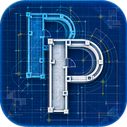

<p align="center">
  
</p>

# PieniPlan

현재 버전: **v0.40.0 · Build 54**

**Small Web Floor Plan Editor**  
**Plan simply. Draft precisely.**

PieniPlan은 브라우저에서 빠르게 평면을 만들고, 필요하면 같은 프로젝트를 CAD 방식으로 더 정밀하게 다룰 수 있는 웹 도면 편집기입니다.

- **바로 실행:** https://bak2ya.github.io/PieniPlan/
- **GitHub:** https://github.com/Bak2ya/PieniPlan

PieniPlan의 핵심 방향은 단순합니다.

> **Plan Mode는 편하고 단순하게, CAD Mode는 CAD답게.**

두 모드는 같은 실제 좌표를 공유하지만, 서로의 역할을 억지로 섞지 않습니다.

---

## Plan Mode

CAD를 잘 몰라도 건물의 평면 구조를 빠르게 만들고 정리하는 모드입니다.

- 실제 치수 기반 직선·곡선 평면 경계 작성
- 문, 창, 공간, 계단 같은 의미 요소 배치
- 변기·세면대·싱크·가전·가구 등 기본 구성품을 하나의 Component 객체로 배치·회전·반전·복사
- 여러 **건물 → 도면 → 공간** 계층 관리
- 건물과 도면의 순서를 각각 직접 편집
- 도면별 참조 CAD/DXF·이미지 표시와 불투명도 조절
- 참조 도면을 따라 트레이싱
- 알고 있는 실제 길이를 이용한 **기준 치수 맞추기**
- Window / Crossing 다중 선택
- 이동, 복사, TRIM, EXTEND, ERASE, DIST 등 익숙한 편집 흐름
- SNAP과 별도로 유지되는 기하 제약
- Shift를 이용한 각도·이동축 제약
- 닫힌 경계에서 공간 생성 및 공간 이름/유형 관리
- 도면 계산 면적과 관리 면적을 분리해 보존
- CAD Drawing Region에서 건축 구조를 인식해 Plan 객체로 단순화
- 여러 직선/호 조각을 사용자가 확인하며 하나의 **Curved Wall**로 복원하는 반자동 Curve Reconstruction

Plan의 구획 목록은 **건물 → 도면 → 공간** 관계를 한 자리에서 보여줍니다. 건물 안에 여러 도면을 둘 수 있고, 도면은 꼭 한 층과 1:1일 필요가 없습니다. 같은 층을 여러 도면으로 나누거나 `5F 동측`, `옥상`, `기계실`, `소방`처럼 목적에 맞는 이름으로 자유롭게 구성할 수 있습니다. 참조 도면 제어는 각 도면 안에 함께 표시됩니다.

---

## CAD Mode

DXF geometry와 Layer를 직접 다루는 정밀 작업 모드입니다.

- DXF 열기 및 편집
- CAD Layer 생성, 이름 변경, 삭제, 현재 Layer, Lock/Unlock
- 레이어 이름 옆 원형 색상 표시와 빠른 색상 선택
- 전체 도면 + Drawing Region별 Layer 표시 상태와 지역별 ON/OFF override
- GRID / SNAP / ORTHO / POLAR
- Window / Crossing Selection
- Command Console과 명령 입력
- LINE과 **PLINE(직선/호 혼합, 열림/닫힘)** 작성, TRIM, EXTEND, BREAK, JOIN, OFFSET, FILLET, ERASE, DIST 등 CAD식 작업 흐름
- 분절된 LINE/ARC 조각을 후보로 고르고 미리보기·제외/추가·`더 찾기` 후 하나의 analytic ARC로 확정하는 **Curve Reconstruction (`CR`)**
- PLINE 작성 중 Context strip의 `직선 / 호 / 되돌리기 / 닫기`를 우클릭에서도 같은 현재-command action으로 즉시 사용
- LINE / CIRCLE / ARC 교점 기반 정밀 Snap과 곡선·TEXT 선택
- PPRJ schema5 기반 persistent `cadPolyline`: 하나의 owner로 저장하고 stable vertex/edge ID, LINE/ARC analytic cache, Render/Selection/Snap/GeometryQuery를 공유하며 PLINE으로 직접 작성
- 특정 Drawing Region의 기준점·방향 기반 회전
- Metric / Imperial 입력·표시 구조
- Plan Overlay와 외부 Reference를 CAD 원본과 분리해 안전하게 취급

PieniPlan은 AutoCAD 전체를 복제하려는 프로젝트가 아닙니다. 목표는 **2D 건축 평면 작업에 필요한 기능을 익숙하고 예측 가능한 방식으로 제공하는 것**입니다. 일부 Modify 명령은 현재 검증된 형상 조합부터 단계적으로 확장하고 있습니다. 현재 PLINE은 **연속 직선, 3점 방식 ARC 구간, 열림/닫힘, 되돌리기, 좌표 입력, preview, 전체 owner 선택·이동·복제·90° 회전·반전, Undo/Redo, PPRJ 저장/재열기**까지 지원합니다. **BREAK는 cadLine뿐 아니라 persistent Polyline도 지원**하며, 잘라내고 남은 조각의 기존 vertex/edge ID는 가능한 범위에서 유지하고 새로 생긴 경계/추가 owner에만 새 ID를 부여합니다. **EXTEND는 열린 Polyline의 첫/마지막 terminal segment를 지원하며 직선과 ARC 모두 같은 owner/vertex/edge ID를 유지한 채 가장 가까운 유효 경계까지 연장**합니다. 닫힌 Polyline과 내부 segment는 임의 endpoint를 추측하지 않고 거부합니다. **TRIM은 클릭한 Polyline edge를 local trim domain으로 사용해 교차 경계 사이의 구간을 preview 후 제거하며, 직선/ARC edge와 open/closed owner topology를 처리합니다.** 유지되는 기존 vertex/edge ID는 가능한 범위에서 보존하고 새 절단 경계와 추가 owner에만 새 ID를 부여합니다. **JOIN은 끝점이 정확히 맞닿은 두 개의 열린 persistent Polyline을 하나의 owner로 결합**하며, 첫 owner와 공유 junction vertex를 survivor로 두고 나머지 기존 vertex/edge ID와 ARC bulge를 보존합니다. 서로 다른 레이어/표현/메타데이터, 닫힌 Polyline, gap 연결, 자동 Close는 거부합니다. **OFFSET은 open/closed persistent Polyline의 직선·ARC 혼합 geometry를 한쪽으로 평행/동심 이동해 새로운 Polyline owner를 만들며 원본은 그대로 유지**합니다. 인접 구간은 analytic support 교점으로 연결하고, 해석이 모호하거나 ARC 반경이 붕괴하는 경우에는 근사하지 않고 거부합니다. **FILLET은 같은 persistent Polyline 안의 서로 인접한 LINE/ARC 구간을 analytic tangent geometry로 모깎기하며 LINE↔LINE, LINE↔ARC, ARC↔ARC 조합을 지원합니다.** 기존 source ARC의 원 중심·반경 locus와 가능한 기존 edge identity를 유지하고 새 fillet ARC에 필요한 topology만 추가하며, 해가 모호하거나 반지름이 성립하지 않으면 근사하지 않고 거부합니다. **선택한 persistent PLINE은 속성 패널이나 우클릭 메뉴에서 명시적으로 닫기/열기 할 수 있습니다.** 닫기는 마지막 점과 첫 점을 하나의 직선 closing edge로 연결하고, 열기는 그 저장된 closing edge만 제거합니다. JOIN은 이 동작을 자동으로 대신하지 않습니다.

**Curve Reconstruction은 자동으로 원본을 바꾸지 않는 반자동 도구입니다.** `CR`에서 관련 LINE/ARC 조각을 직접 포함·제외하며 fitted curve 미리보기를 확인하고, 필요하면 `더 찾기`로 주변 후보를 추가한 뒤 확정합니다. CAD에서는 현재 독립 LINE/ARC 조각만 하나의 ARC로 교체하고 persistent PLINE owner는 부분 분해하지 않습니다. Plan Mode에서는 안전한 벽 조각을 하나의 Curved Wall로 복원하며, 문·창·치수나 외부 벽 관계·기하 제약이 연결된 경우에는 관계를 추측해 깨뜨리지 않고 변환을 거부합니다.

---

## 참조 도면과 트레이싱

Plan 도면에는 CAD/DXF 또는 이미지를 밑그림으로 연결할 수 있습니다.

각 도면에서 바로:

- 표시 / 숨김
- 불투명도 슬라이더
- 숫자 % 직접 입력
- 화면 맞춤

을 사용할 수 있습니다.

이미지나 참조 도면의 축척을 모르는 경우, 두 점 사이의 실제 길이를 입력하거나 이미 그린 Plan 선의 길이를 기준으로 **참조 도면만**, 또는 **참조 도면 + 현재 Plan 도면**을 함께 실제 크기에 맞출 수 있습니다.

PDF 참조 렌더링은 아직 구현하지 않았습니다.

---

## 기본 구성품

PieniPlan에는 일반적인 평면 작업에서 자주 쓰는 **Starter Components**가 포함됩니다. 변기, 소변기, 세면대, 싱크, 욕조, 샤워, 주방·세탁 가전, 책상, 의자, 소파, 침대 등 기본 항목을 Plan/CAD 양쪽에서 배치할 수 있습니다.

구성품은 내부 선 조각을 프로젝트에 수십 개씩 풀어 저장하지 않고, 하나의 `ComponentInstance`로 다룹니다. 따라서 선택·이동·복사·회전·반전·삭제가 한 객체 단위로 이루어지고 프로젝트에는 asset ID와 위치/회전/반전/크기 정보가 저장됩니다.

Starter Components의 치수·출처 기준은 **CADdillo CC0 1.0** 공개 CAD block catalogue입니다. Build35에서는 원본 DXF 바이너리를 그대로 포함한 것이 아니라, 공개된 footprint와 insertion datum을 기준으로 PieniPlan용 단순 plan symbol로 정규화했습니다. 각 항목의 출처·라이선스·원본 단위·정규화 내역은 `assets/components/ASSET_PROVENANCE.md`에 기록합니다.

---

## 프로젝트와 Plan Package

PieniPlan은 작업 파일과 Plan 결과물을 구분합니다.

### `.pprj` — PieniPlan Project

전체 편집 프로젝트입니다.

- CAD / DXF 작업 상태
- Plan 도면과 의미 객체
- Drawing Region
- Layer 상태
- 참조 도면
- 기준축과 편집 설정
- 카메라와 프로젝트 상태

기존 `.ppln` / `.pieniplan` 프로젝트도 계속 열 수 있으며, 새 portable 프로젝트는 `.pprj`를 사용합니다.

### `.ppkg` — PieniPlan Plan Package

Plan Mode의 의미 도면만 교환하기 위한 가벼운 패키지입니다.

- CAD 원본과 참조 파일은 포함하지 않음
- 한 도면부터 여러 도면까지 포함 가능
- 여러 건물을 한 패키지에 구성 가능
- 건축 / 소방 / 전기 / 통신 / 기계 / 설비 / 구조 / 기타 분야 구분
- 다른 PPKG를 불러와 같은 건물 아래에 병합 가능
- 파일 이름이 달라도 병합 화면에서 같은 건물로 지정 가능

메인 화면의 **플랜 병합**을 이용하면 여러 PPKG를 하나의 Facility용 도면 세트로 정리할 수 있습니다.

---

## Facility Manager와의 방향

PieniPlan은 **도면을 만드는 도구**, Facility Manager는 **완성된 공간 위에 설비·자산·점검 정보를 관리하는 도구**로 역할을 나누는 방향을 지향합니다.

PieniPlan이 내보내는 PPKG에는 공간 geometry와 안정적인 ID를 유지해, 나중에 도면을 수정해 다시 가져와도 Facility Manager의 자산·점검 정보와 분리해서 갱신할 수 있도록 설계하고 있습니다.

향후 Facility Manager 프로젝트 형식은 `.facl`을 사용할 예정이며, FACL 안에 PPKG 도면 영역을 포함하는 구조를 고려하고 있습니다. 이 부분은 아직 구현 전의 파일 생태계 방향입니다.

---

## 파일 흐름

```text
PieniPlan 작업
    │
    ├─ 프로젝트 저장 / 내보내기 → .pprj
    │
    └─ Plan만 내보내기          → .ppkg
                                      │
                         여러 PPKG 병합 / 정리
                                      │
                                      ▼
                              Facility Manager
```

Native DWG 편집은 지원 범위에 포함하지 않습니다. DWG가 필요한 경우 DXF로 변환한 뒤 PieniPlan에서 사용하는 흐름을 권장합니다.

### 관련 도구 — DWG2DXF

DWG 파일만 가지고 있다면 별도 경량 변환 도구인 **[DWG2DXF](https://bak2ya.github.io/DWGtoDXF/)**를 이용해 DXF로 준비한 뒤 PieniPlan에서 열 수 있습니다. DWG2DXF는 PieniPlan의 필수 구성요소가 아니라 독립 도구이며, 변환과 PieniPlan 편집 workflow를 느슨하게 연결하는 용도입니다.

- 웹: https://bak2ya.github.io/DWGtoDXF/
- GitHub: https://github.com/Bak2ya/DWGtoDXF

---

## 설정과 화면

PieniPlan의 앱 설정은 현재 프로젝트 데이터와 분리해서 관리합니다.

- 한국어 / English
- 새 프로젝트 기본 단위: Metric / Imperial
- System / Light / Dark / Black 테마
- UI 텍스트 크기: 더 작게 / 작게 / 기본 / 크게
- 원본 PPRJ를 자동으로 덮어쓰지 않는 별도 Recovery snapshot
- **우클릭 메뉴**: 현재 도구·도구 그룹·선택 객체에 맞춰 동적으로 구성되며, 설정에서 명령별 표시(`자동 / 표시 / 숨김`)와 우선순위(`기본 / 높음 / 보통 / 낮음`)를 사용자 취향에 맞게 덮어쓸 수 있습니다. 이 설정은 프로젝트가 아니라 앱 환경설정에 저장됩니다.

Plan과 CAD는 같은 Compact Ribbon / Canvas / Inspector / Command 영역을 공유합니다. 모드를 바꿔도 공통 기능의 위치가 크게 바뀌지 않도록 구성하고, CAD 전용 기능만 필요한 곳에서 추가로 보여줍니다.

---

## 제품 방향

PieniPlan은 기능을 숨겨서 단순해 보이게 만드는 것보다, **사용자가 느끼는 복잡성을 줄이는 것**을 중요하게 생각합니다.

- 사용 빈도가 높은 기능은 바로 보이게
- 세부 기능은 필요할 때만 드러나게
- Plan과 CAD의 책임을 명확하게
- 선택, 펼침, 편집 상태를 서로 섞지 않게
- 원본과 편집 결과의 관계를 명확하게
- 큰 도면에서도 반응성을 잃지 않게
- 익숙한 CAD 관습은 이유 없이 새로 발명하지 않게
- 사용자가 만든 데이터는 안전하게 저장하고 되돌릴 수 있게

PieniPlan은 계속 다듬어지고 있습니다. 실제 도면을 직접 사용하면서 발견되는 불편과 성능 문제를 기준으로 기능과 구조를 확장합니다.
